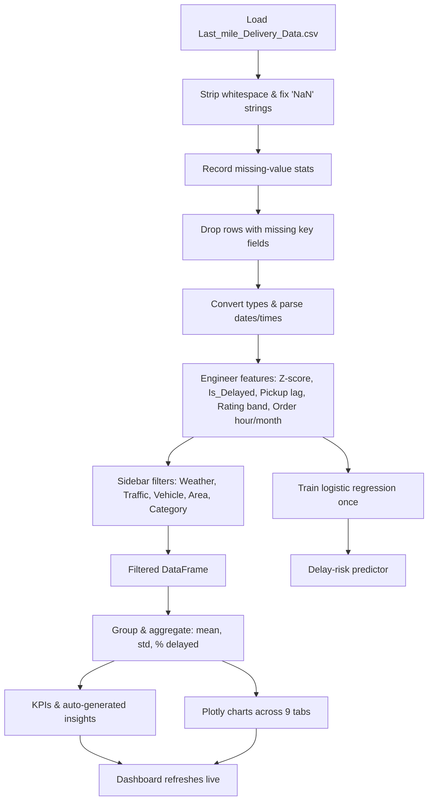

# 1000408_Sri-Prasath.P_FA2_Last-Mile-Delivery-Performance-Dashboard
# 🚚 Last-Mile Delivery Performance Dashboard

**LogiSight Analytics Pvt. Ltd. — Mathematics for AI-II (FA-1 & FA-2)**

An interactive Streamlit dashboard that helps logistics managers understand *where* and *why* last-mile deliveries get delayed, and which operational factors (weather, traffic, vehicle type, agent profile, area, product category) matter most.

| | |
|---|---|
| 🔗 **Live App** | [Open the deployed dashboard](https://1000408sri-prasathpfa2last-mile-delivery-performance-dashboard.streamlit.app/) |
| 🎨 **FA-1 Storyboard & Data Flow (Canva)** | [View the Canva presentation](https://www.canva.com/design/DAHS6PMDg2A/exVKIxkesrh9zYe7H6nHWA/view?utm_content=DAHS6PMDg2A&utm_campaign=designshare&utm_medium=link2&utm_source=uniquelinks&utlId=hafb418c757) |
| 👤 **Student Name** | Sri Prasath.P |
| **Student ID** | 1000408|
---

## 📌 Table of Contents
1. [Project Overview](#-project-overview)
2. [Business Questions Answered](#-business-questions-answered)
3. [Dataset](#-dataset)
4. [Key Features](#-key-features)
5. [Data Cleaning & Preparation](#-data-cleaning--preparation)
6. [Metrics & Maths Used](#-metrics--maths-used)
7. [Dashboard Walkthrough](#-dashboard-walkthrough)
8. [Data Logic Flow](#-data-logic-flow)
9. [Tech Stack](#-tech-stack)
10. [Project Structure](#-project-structure)
11. [Run Locally](#-run-locally)
12. [Deploy on Streamlit Cloud](#-deploy-on-streamlit-cloud)
13. [Assignment Mapping (FA-1 / FA-2)](#-assignment-mapping-fa-1--fa-2)
14. [Limitations & Future Work](#-limitations--future-work)

---

## 🎯 Project Overview

Last-mile delivery is the most expensive and least predictable part of the logistics chain. Managers need quick, evidence-based answers to everyday operational questions rather than raw spreadsheets.

This project turns a real delivery dataset into a **live, filterable dashboard**:

- **FA-1 (Planning & Design):** business questions, feature planning, storyboard and data-logic flowchart (see the Canva link above).
- **FA-2 (Build & Deploy):** data cleaning in pandas, Plotly visualisations, a Streamlit interface with sidebar filters, and deployment on Streamlit Cloud via GitHub.

Every chart, KPI and insight sentence is **computed live from the filtered data**, so nothing is hard-coded.

---

## ❓ Business Questions Answered

| # | Business Question | Columns Used | Where in the Dashboard |
|---|---|---|---|
| 1 | Are deliveries slower in heavy traffic or bad weather? | `Delivery_Time`, `Weather`, `Traffic` | Delay Analyzer |
| 2 | Which vehicle type completes deliveries fastest? | `Delivery_Time`, `Vehicle` | Vehicle & Agents |
| 3 | Do experienced or higher-rated agents deliver faster? | `Agent_Age`, `Agent_Rating`, `Delivery_Time` | Vehicle & Agents |
| 4 | Which areas are bottlenecks with frequent delays? | `Area`, `Delivery_Time` | Regional & Category |
| 5 | Do some product categories face repeat delays? | `Category`, `Delivery_Time` | Regional & Category |

---

## 📂 Dataset

- **File:** `Last_mile_Delivery_Data.csv` (based on the public *Amazon Delivery Dataset* from Kaggle)
- **Size:** 43,739 rows × 16 columns

| Column | Description |
|---|---|
| `Order_ID` | Unique order identifier |
| `Agent_Age`, `Agent_Rating` | Delivery agent's age and rating |
| `Store_Latitude/Longitude`, `Drop_Latitude/Longitude` | Pickup and drop-off coordinates |
| `Order_Date`, `Order_Time`, `Pickup_Time` | Order timestamps |
| `Weather` | Sunny, Cloudy, Fog, Windy, Stormy, Sandstorms |
| `Traffic` | Low, Medium, High, Jam |
| `Vehicle` | motorcycle, scooter, van, bicycle |
| `Area` | Urban, Metropolitian, Semi-Urban, Other |
| `Delivery_Time` | Total delivery time in **minutes** (target metric) |
| `Category` | Product category (Clothing, Electronics, Grocery, etc.) |

---

## ✨ Key Features

**Compulsory visualisations (FA-2)**
- 📊 **Delay Analyzer** – average delivery time ± σ by weather, violin plot by traffic, plus a Weather × Traffic heatmap
- 🏍️ **Vehicle Comparison** – bar chart of average delivery time by vehicle type
- 🎯 **Agent Performance** – rating vs delivery time scatter plot with least-squares trend line, age vs time, and rating-band comparison
- 🗺️ **Area Analysis** – average delivery time and delay % by area
- 📦 **Category Visualizer** – area → category treemap of delivery times

**Optional / bonus visualisations**
- 📈 Monthly trend with 3-month moving average
- 📉 Delivery-time histogram with fitted normal curve
- ⏱️ % late deliveries by traffic and weather
- 🍩 Delivery volume share by area (agent workload proxy)
- 🕐 % delayed by order hour; pickup lag vs delivery time

**Extra analytics**
- 🧠 Auto-generated key insights (recalculated on every filter change)
- 🧮 Descriptive statistics, correlation matrix, z-score outlier detection
- 🌍 Store vs drop-off map
- 🔮 Delay-risk predictor (logistic regression)
- 📐 Welch's t-test with 95% confidence interval to compare two vehicle types
- 🔎 Order ID search and side-by-side group comparison

**Interface**
- Sidebar filters: Weather, Traffic, Vehicle, Area, Category (multi-select)
- Working **Reset Filters** button
- **Download filtered data** as CSV
- Transparent **Data Cleaning Summary** panel
- Custom neon dark theme

---

## 🧹 Data Cleaning & Preparation

1. **Load** the CSV with pandas; cache keyed by the file's MD5 hash so dataset updates are picked up automatically.
2. **Strip whitespace** from text columns (the raw file contains values such as `"Urban "` and `"NaN "`).
3. **Fix the literal `"NaN"` string** in `Traffic` and convert it to a true missing value.
4. **Count missing values** in `Weather`, `Traffic`, `Agent_Rating` and `Delivery_Time` *before* dropping them, so the cleaning panel reports exact figures.
5. **Drop rows** with missing values in those key columns (imputing would distort the very metrics being analysed).
6. **Coerce types:** `Delivery_Time`, `Agent_Age`, `Agent_Rating` converted to numeric.
7. **Parse dates and times** and engineer new features:
   - `Order_Month`, `Order_Hour`
   - `Pickup_Lag_Min` (with midnight wraparound handling)
   - `Rating_Band` (<3.5, 3.5–4.0, 4.0–4.5, 4.5–5.0, 5.0+)
8. **Create calculated metrics:** `Z_Score`, `Is_Delayed`, `Is_Outlier` (see below).

The exact counts of missing and dropped rows are shown inside the dashboard under **🧪 Data Cleaning Summary**.

---

## 🧮 Metrics & Maths Used

| Metric | Formula / Definition |
|---|---|
| **Average delivery time** | Mean of `Delivery_Time` for the filtered data |
| **Median / Std. deviation (σ)** | Standard descriptive statistics |
| **Z-score** | `z = (x − μ) / σ` |
| **Delayed delivery** | `Delivery_Time > μ` (above the dataset mean) |
| **% Delayed** | `mean(Is_Delayed) × 100` per group |
| **Outlier** | `|z| > 3` |
| **Trend line** | Least-squares fit via `np.polyfit`, with Pearson *r* and R² |
| **Moving average** | 3-month rolling mean |
| **Normal fit** | Gaussian PDF from sample μ and σ, scaled to the histogram |
| **Significance test** | Welch's t-test (`scipy.stats.ttest_ind`, `equal_var=False`) with a 95% CI |
| **Delay-risk model** | One-hot encoded logistic regression (scikit-learn) |

---

## 🖥️ Dashboard Walkthrough

| Tab | What it shows | Manager's takeaway |
|---|---|---|
| 📊 **Overview** | Key insights, monthly trend, distribution, % late, area workload | Quick health check of the whole operation |
| 🌦️ **Delay Analyzer** | Weather & traffic impact, heatmap | Identify worst-case weather/traffic pairings and plan resources |
| 🏍️ **Vehicle & Agents** | Vehicle speeds, rating bands, age/rating scatter | Optimise fleet mix; target training or staffing |
| 🗺️ **Regional & Category** | Area bar chart, category treemap | Prioritise problem zones and product types |
| 📈 **Trends & Distribution** | Order-hour risk, pickup lag | Spot peak-risk hours and slow pickups |
| 🧮 **Statistics** | Describe table, correlations, outliers | Statistical rigour behind the visuals |
| 🌍 **Live Map** | Store vs drop-off points | Geographic spread of operations |
| 🔮 **Insights & Predict** | Delay probability gauge, t-test | "What-if" planning and proof that differences are real |
| 🔎 **Search & Compare** | Order lookup, group comparison | Drill into one order or compare any two segments |

> 💡 *Tip: add screenshots here. Create a `screenshots/` folder in the repo and embed them, for example:*
> ``

---

## 🔄 Data Logic Flow



The full visual flowchart and storyboard are in the [Canva presentation](https://www.canva.com/design/DAHS6PMDg2A/exVKIxkesrh9zYe7H6nHWA/view?utm_content=DAHS6PMDg2A&utm_campaign=designshare&utm_medium=link2&utm_source=uniquelinks&utlId=hafb418c757).

---

## 🛠️ Tech Stack

| Purpose | Library |
|---|---|
| Web app / UI | Streamlit |
| Data processing | pandas, NumPy |
| Visualisation | Plotly (Express & Graph Objects) |
| Statistics | SciPy |
| Machine learning | scikit-learn |
| Hosting | GitHub + Streamlit Community Cloud |

---

## 📁 Project Structure

```
.
├── app.py                        # Streamlit application (data cleaning, charts, UI)
├── Last_mile_Delivery_Data.csv   # Dataset
├── requirements.txt              # Python dependencies
├── README.md                     # Project documentation
└── screenshots/                  # (optional) dashboard screenshots
```

> If your main file has a different name than `app.py`, update it above.

---

## 💻 Run Locally

**Prerequisites:** Python 3.9+

```bash
# 1. Clone the repository
git clone https://github.com/<your-username>/<your-repo-name>.git
cd <your-repo-name>

# 2. (Optional) create a virtual environment
python -m venv venv
source venv/bin/activate        # Windows: venv\Scripts\activate

# 3. Install dependencies
pip install -r requirements.txt

# 4. Run the app
streamlit run app.py
```

The app opens at `http://localhost:8501`. Make sure `Last_mile_Delivery_Data.csv` sits in the same folder as `app.py`.

---

## ☁️ Deploy on Streamlit Cloud

1. Push `app.py`, `requirements.txt` and the CSV to a GitHub repository.
2. Go to [share.streamlit.io](https://share.streamlit.io) and sign in with GitHub.
3. Click **Create app / Deploy**, choose the repository and branch, and set the main file to `app.py`.
4. Click **Deploy**. Streamlit builds the app and gives you a public URL.

**Deployed app:** https://1000408sri-prasathpfa2last-mile-delivery-performance-dashboard.streamlit.app/

---

## ✅ Assignment Mapping (FA-1 / FA-2)

| Requirement | Where it is covered |
|---|---|
| FA-1: Business questions linked to columns | [Business Questions Answered](#-business-questions-answered) |
| FA-1: Feature planning & explanation | [Key Features](#-key-features) and [Dashboard Walkthrough](#-dashboard-walkthrough) |
| FA-1: Storyboard & data logic flowchart | Canva presentation + [Data Logic Flow](#-data-logic-flow) |
| FA-2: Data cleaning & metrics | [Data Cleaning & Preparation](#-data-cleaning--preparation), [Metrics & Maths Used](#-metrics--maths-used) |
| FA-2: 5 compulsory visuals | Delay Analyzer, Vehicle Comparison, Agent Scatter, Area Analysis, Category Visualizer |
| FA-2: Optional visuals (up to 4) | Monthly trend, histogram, % late, area workload |
| FA-2: Sidebar filters & live updates | Sidebar filter console with reset + CSV download |
| FA-2: GitHub + Streamlit Cloud deployment | [Deploy on Streamlit Cloud](#-deploy-on-streamlit-cloud) |

---

## ⚠️ Limitations & Future Work

- The dataset has no unique agent ID, so "agent workload" is approximated by delivery volume per area.
- "Delayed" is defined as above the mean delivery time; a stricter definition (mean + 1σ) could be added as a toggle.
- Rows with missing key fields are dropped rather than imputed.
- The prediction model uses only categorical conditions; adding distance, hour and agent features would improve accuracy.
- Future ideas: distance-based features from the coordinates, a delay-threshold slider, and a date-range filter.

---

## 📜 Acknowledgements

- Dataset: *Amazon Delivery Dataset* (Kaggle, Sujal Suthar)
- Built for the **Mathematics for AI-II** course, CRS Artificial Intelligence

*Made with ❤️ using Python & Streamlit — LogiSight Analytics*
